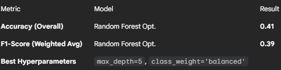

# Clothes Size PRediction 👚

### 📊 Overview
This project predicts clothing size based on height, weight, and age.  
It was my first complete Machine Learning pipeline — including data processing, feature engineering, model training, and inference.

### ⚙️ Tech Stack
- Python (pandas, numpy, scikit-learn, matplotlib, seaborn)
- Modular pipelines for ETL, EDA, feature engineering, training & inference

### 📈 Results
Best model: Logistic Regression  
Accuracy: ~42.5%

> Even though performance wasn’t high, this project focuses on the pipeline architecture and reproducibility.

---

# UPDATE 0.1 November 1st - 2025
## 🏆 Final Conclusions and Learnings (V2.0)

The goal of this project was to predict clothing size (multi-class) using only the features of **Weight**, **Height**, and **Age**. Despite rigorous optimization, the model hit a performance ceiling that revealed an inherent limitation in the underlying dataset.

The final model (Random Forest) showed only a marginal improvement over the initial linear model (Logistic Regression), which achieved an average F1-Score of 0.37, confirming that the problem did not lie in the algorithm but in the lack of available predictive information.

## Key Data Engineering Lessons Learned
This project successfully validated and applied the following MLOps and Data Science best practices:

**Feature Validation (EDA):** Exploratory data analysis revealed extreme overlap in the ranges of Weight and Height for the central sizes (S, M, L, XL). This lack of clear separation prevented both linear and non-linear models from achieving useful accuracy.

**Pipeline Refactoring:** The pipeline was successfully refactored to eliminate redundant Feature Engineering (e.g., BMI) and implement mandatory scaling (StandardScaler) and class imbalance handling (class_weight='balanced') directly in the feature_engineering.py script.

**Rigorous Model Selection:** The process pivoted from a simple model (Logistic Regression) to a complex one (Random Forest) via GridSearchCV to definitively prove that the performance ceiling was due to the data, not a lack of computational power or model complexity.

## Business Conclusion and Next Steps
The conclusion is that a clothing size prediction model cannot be viable using only these three features with the current data distribution.

The only way to break through this performance ceiling is by acquiring new data.

**High Priority: Gender:** Clothing size varies drastically based on a person's sex. Without this feature, the overlap in Weight/Height is fundamentally unresolvable.

**Medium Priority: Garment Type:** A size 'M' for a jacket differs from a size 'M' for pants, which is a necessary piece of information missing from the dataset.

This project is an engineering success because it demonstrates the ability to build a robust pipeline and derive a critical business conclusion—that more data is needed—even when the initial model performance is low.